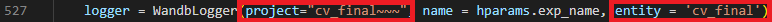
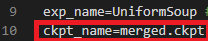
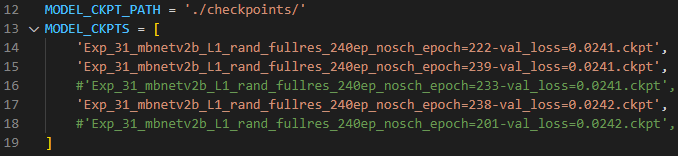
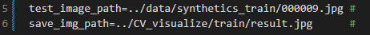

# CV2022Final_Face_Landmark_Detection
## Outline
- [Preparing](#Preparing)
- [Image resoultion](#Image_resoultion)
- [Final setup](#setup)
- [Taining](#Training)
- [Testing](#Testing)
- [Average models](#Average)
- [Generate solution.txt](#Generate)
- [Inference one image](#Inference_one)
- [Visualization](#Visualization)

<h2 id = "Preparing"> Preparing </h2>

---

### Wandb
---
Login your wandb.

Enter this command in shell
```
wandb login
```
In **main.py** change your project and entity
 <br>
<br>

### Data
---
Under the path you save your dataset, you should make sure that you have included these folders
```
<Dataset Directory>  
└─── synthetics_train
└─── aflw_val
└─── aflw_test
```
<br>

<h2 id = "Image_resoultion"> Image resoultion </h2>

---
In **main.py**
```
input_resolution=384 
```
<br>

## Script
---
```
<script Directory>  
└─── train.sh
└─── test.sh
└─── gen_result.sh
└─── gen_visualize.sh
└─── inference_one.sh
└─── adapt.sh
└─── infadapt_testerence_one.sh
```
<br>

<h2 id = "setup"> Final setup </h2>

---

<table>
  <tr style=" border-top: 1px solid white;">
    <th style="text-align:center">Backbone</th>
    <th style="text-align:center">Loss</th>
    <th style="text-align:center">Optimizer</th>
    <th style="text-align:center">Learning Rate</th>
    <th style="text-align:center">Weight Decay</th>
    <th style="text-align:center">Momentum</th>
    <th style="text-align:center">LR Scheduler</th>
    <th style="text-align:center">Epoch</th>
  </tr>
  <tr style=" border-bottom: 1px solid white;">
    <td style="text-align:center">MobileNetV2(1.25)</td>
    <td style="text-align:center">L1</td>
    <td style="text-align:center">SGD</td>
    <td style="text-align:center">0.01</td>
    <td style="text-align:center">0.00001</td>
    <td style="text-align:center">0.9</td>
    <td style="text-align:center">Disable</td>
    <td style="text-align:center">240</td>
  </tr>
</table>
<br>

<h2 id = "Training"> Training </h2>

---
- Open train.sh and ensure that setting is what you want.<br>
- There are some flag you can use for training
    - --use_sam 
        - optimizer + SAM
    - --use_swa 
        - Use SWA
    - --cood_en 
        - Coordconv
    - --lr_nosch
        - Disable learning scheduler

Enter the command
```
./script/train.sh
```
<br>

<h2 id = "Testing"> Testing </h2>

---
- Ensure that backone is the same as training <br>
- Select the ckpt you want to test <br>
 <br>

- There are some flag you can use for testing
    - --cood_en 
        - Coordconv (Only for Coordconv)
    - --use_shift
        - Shift the image along x-axis, y-axis and average the all detections

Enter the command
```
./script/test.sh
```
<br>

<h2 id = "Average"> Average models </h2>

---
- In **soup.py**, select the chekpoints you want to use
 <br>

- They should come from smae backbone model

Enter the command
```
python soup.py
```
<br>

<h2 id = "Generate"> Generate solution.txt </h2>

---
- Ensure that backone is the same as training <br>
- Select the ckpt you want to generate solution <br>

- There are some flag you can use for testing
    - --use_shift
        - Shift the image along x-axis, y-axis and average the all detections

**<font color=#FF0000>※ gen_result do not support Coordconv </font>**

Enter the command
```
./script/gen_result.sh
```
<br>

<h2 id = "Inference_one"> Inference and plot one image </h2>

---
- Select the ckpt you want to generate solution <br>
- Specify the image you want to inference <br>
- Remember giving the file name for result <br>

 <br>

**<font color=#FF0000>※ Inference_one do not support Coordconv and 25_shift iamges </font>**

Enter the command
```
./script/inference_one.sh
```
<br>

<h2 id = "Visualization"> Visualization </h2>

---
Our work supports the visualization from [pytorch/captum](https://github.com/pytorch/captum) and [Captum/GradientShap](https://captum.ai/api/gradient_shap.html).  
There are five modes you can choose,  

0. Default
1. Face Silhouette
2. Eyes
3. Nose
4. Mouth

**<font color=#FF0000>※ This operation requires a lot of RAM.</font> It is better to use cpu rather than GPU and makce sure that <font color=#FF0000>RAM > 50 GB </font>is available.**

To visualize your model of an image,
```
./script/gen_visualize.sh
```